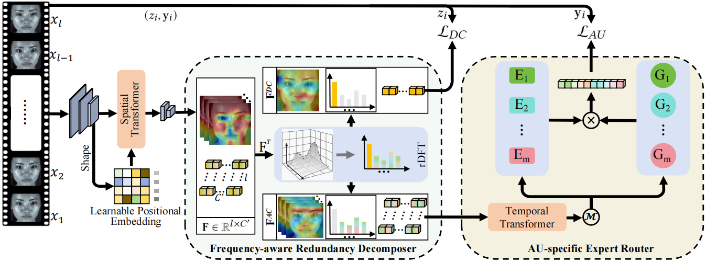

# AC4AU
Core code of our newest work on ACM MM 2025 about action unit detection on micro-expressions.

# Regulatory Focus Theory Induced Micro-Expression Analysis with Structured Representation Learning

Comparison of apex-based methods and our apex-free framework: blue and green dashed ellipses denote MEs, yellow solid ellipses mark redundant information, and black dashed ellipses indicate similar patterns. The dark red dashed ellipse highlights that prior methods, lacking temporal perception and complete representations, often produce ambiguous groupings. Notably, our method eliminates apex reliance by uniformly sampling sequences, with only the onset frame guaranteed.

Overview of the proposed AC4AU for apex-free AU activation detection from micro-expression sequences. Given a uniform sampled sequence $\left\{x_1, \ldots, x_l\right\}$, frame-level features are first extracted using a MobileFaceNet-based backbone, into which a spatial transformer with learnable positional embeddings is integrated to enhance noise-robust spatial representation. The resulting sequence $\mathbf{F} \in \mathbb{R}^{l \times C^{\prime}}$ is then processed by the Frequency-aware Redundancy Decomposer (FRD), which separates temporally invariant redundancy $\mathbf{F}^{DC}$ and emotion-relevant dynamics $\mathbf{F}^{AC}$ via rDFT. The resulting dynamics is passed through a temporal transformer and routed by the AU-specific Expert Router (AUsER) for final prediction. The colored cubes represent different representations: yellow denotes temporally invariant redundancy, while others indicate emotional dynamics.
## 🔧 Coming Soon
The core code is coming soon, please stay tuned! For the training and inference benchmark, please refer to CD6ME: https://github.com/tvaranka/meb.
